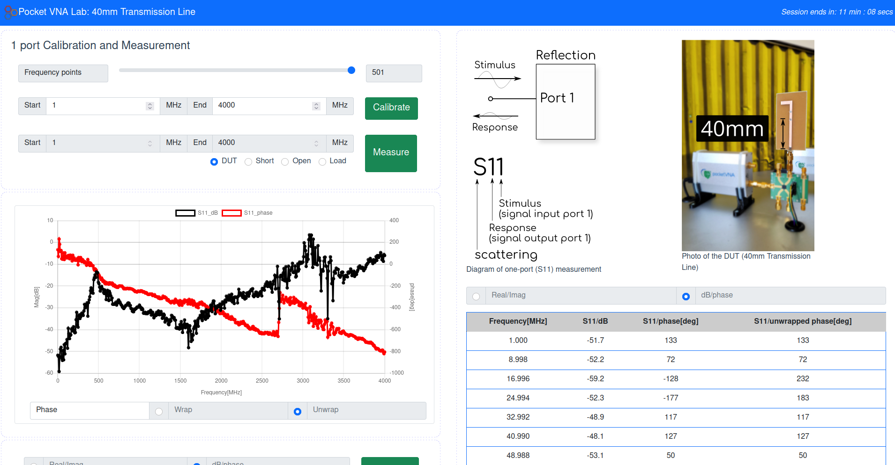
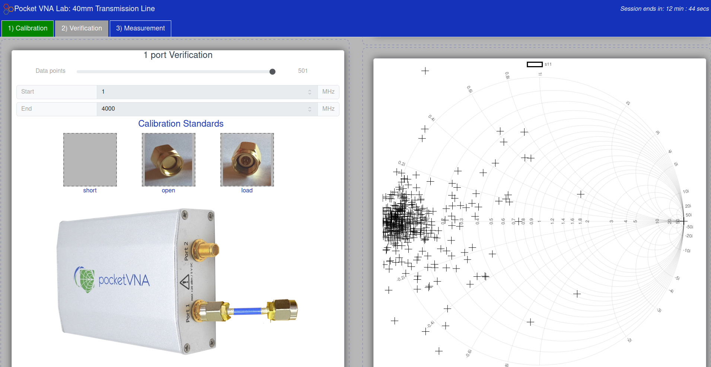

# Pocket VNA 1-port User Interface

Two interfaces are currently available for the pvna-oneport remote lab.

- [default](./default/)
- [graphical](./graphical/)


## default UI

The **default** interface is a single page app with an automated calibration procedure. Users set the number of data points as well as the start and end frequencies for calibration. After calibrating, users have access to the DUT (device under test) measurement, as well as short, open and load measurements for verification of the calibration.

Data (magnitude and phase) are plotted on an interactive graph: either plot can be hidden/shown by clicking the corresponding box in the graph legend. Phase can be plotted wrapped (around 180) or unwrapped. Data are also provided in an on-screen table, which supports either real/imag or mag./phase representations, and can be downloaded for external manipulation as a CSV or s1p file.



## graphical UI

The **graphical** user interface is a multi-page app that simulates the calibration procedure for VNA measurements. Using this UI, users set the number of data points and start and end frequencies, but must also perform the SOL(T) calibration procedure: scanning and saving each calibration standard before the calibration can be completed. Once calibration is complete the ``1) Calibration`` tab turns green and provides access to the ``2) Verification`` tab, where short, open and load measurements can be verified by the user using a smith chart (and standard mag/phase plot). Once verified, the ``3) Measurement`` tab enables measurement of the DUT and display of data using a table, mag/phase plot, smith chart or downloaded for external use.



## Recommended settings

The number of frequency points is restricted to between 2 and 501. A recommended minimum, that helps speed up calibration and measurement, is 201 data points.

The minimum frequency that the PocketVNA can measure is 0.5 MHz and the maximum recommended frequency is 4000 MHz. Outside of this range, the user interface will highlight an issue with the input frequency with a red box around the input.


## Build procedure

Requirements: ```npm```, all experiments are developed and built using a Linux-based OS.

The practable user interfaces use ```vite``` build tools.

The expected build procedure (not tested from scratch) is as follows:

1) Download the [pocket-vna-one-port](https://github.com/practable/pocket-vna-one-port) repo.
2) Navigate to the appropriate ui in the command line e.g.:

```
cd ~/pocket-vna-one-port/ui/default
```
3) Install all necessary packages from the 'package.json' file: ```npm install```
4) Build for development and testing: ```npm run dev```
5) Build for production: ```npm run build``` - the dist folder will contain the built files for deployment

# TODO

- Update of graphical UI images to align with those used in twoport UI.
- Update the calibration procedure to align with the twoport UI (will require a firmware update)